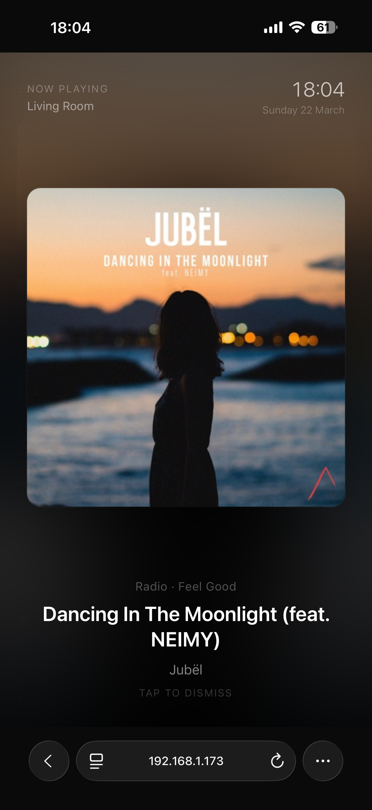
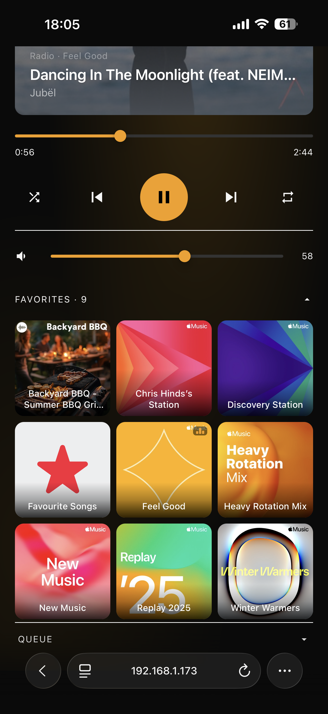

# Sonos Controller

A self-hosted web interface for controlling your Sonos speakers. Runs as a single binary or Docker container — no Sonos app required.


## Features

- **Now playing** — album art, track title, artist, and progress
- **Full playback control** — play/pause, skip, previous, shuffle, repeat
- **Volume control** — per-room and group volume
- **Favorites** — tap-to-play grid of your Sonos favorites
- **Queue** — view and jump to any track in the current queue
- **Multi-room** — switch between all speakers and groups on your network
- **Fullscreen mode** — distraction-free view, great for wall-mounted displays
- **Screensaver** — album art clock that activates after inactivity
- **Per-device settings** — each browser remembers its default room independently
- **Theme** — dark and light mode
- **Colour-matched UI** — accent colours shift to match the current album art
- **Zero cloud** — everything runs locally on your network

| Dark mode                                      | Light mode                                       |
| ---------------------------------------------- | ------------------------------------------------ |
|  |  |

| Fullscreen                                     | Favorites grid                               |
| ---------------------------------------------- | -------------------------------------------- |
|  |  |

---

## Quick start

### Option A — Single binary (recommended for most users)

No Docker, no Node.js. Download, make executable, run.

1. Go to the [latest release](https://github.com/chris-hinds/sonos-controller/releases/latest)
2. Download the binary for your platform:

| Platform                       | File                               |
| ------------------------------ | ---------------------------------- |
| Linux x64                      | `sonos-controller-linux-x64`       |
| Linux ARM64 (Raspberry Pi)     | `sonos-controller-linux-arm64`     |
| macOS Apple Silicon (M1/M2/M3) | `sonos-controller-macos-arm64`     |
| macOS Intel                    | `sonos-controller-macos-x64`       |
| Windows                        | `sonos-controller-windows-x64.exe` |

**Linux:**

```bash
chmod +x sonos-controller-linux-x64
./sonos-controller-linux-x64
```

**macOS Apple Silicon:**

```bash
xattr -d com.apple.quarantine sonos-controller-macos-arm64
chmod +x sonos-controller-macos-arm64
./sonos-controller-macos-arm64
```

**macOS Intel:**

```bash
xattr -d com.apple.quarantine sonos-controller-macos-x64
chmod +x sonos-controller-macos-x64
./sonos-controller-macos-x64
```

**Windows:** Double-click `sonos-controller-windows-x64.exe`

3. Open `http://localhost:3001` in your browser

> **macOS note:** The `xattr` command removes macOS Gatekeeper's quarantine flag that is applied to unsigned binaries downloaded from the internet. The binary is safe — it simply hasn't been notarised with an Apple Developer certificate.

> **Network access:** Any device on the same local network can connect. Share `http://<your-machine-ip>:3001` with other devices — phones, tablets, wall-mounted displays, etc.

---

### Option B — Docker

Requires Docker on a machine that is on the **same network as your Sonos speakers** (host networking is required for UPnP/SSDP discovery).

**Using Docker Compose (recommended):**

```bash
curl -O https://raw.githubusercontent.com/chris-hinds/sonos-controller/main/docker-compose.yml
docker compose up -d
```

**Using Docker directly:**

```bash
docker run -d \
  --network host \
  --restart unless-stopped \
  --name sonos-controller \
  ghcr.io/chris-hinds/sonos-controller:latest
```

Open `http://localhost:3001` in your browser.

**Custom port:**

```bash
docker run -d \
  --network host \
  -e PORT=8080 \
  --name sonos-controller \
  ghcr.io/chris-hinds/sonos-controller:latest
```

---

## Running on a Raspberry Pi

The binary and Docker image both support ARM64. A Raspberry Pi makes an ideal always-on host.

**Binary:**

```bash
wget https://github.com/chris-hinds/sonos-controller/releases/latest/download/sonos-controller-linux-arm64
chmod +x sonos-controller-linux-arm64
./sonos-controller-linux-arm64
```

**Run on boot with systemd:**

```ini
# /etc/systemd/system/sonos-controller.service
[Unit]
Description=Sonos Controller
After=network.target

[Service]
ExecStart=/home/pi/sonos-controller-linux-arm64
Restart=always
User=pi

[Install]
WantedBy=multi-user.target
```

```bash
sudo systemctl enable --now sonos-controller
```

---

## Settings

Each browser stores its own settings in `localStorage` — useful when multiple devices connect to the same server.

| Setting               | Description                                                                   |
| --------------------- | ----------------------------------------------------------------------------- |
| **Default room**      | The speaker/group automatically selected when this browser opens the app      |
| **Display name**      | A label for this device (for your own reference)                              |
| **Screensaver delay** | How long before the album art screensaver activates (30s – 5min, or disabled) |
| **Theme**             | Dark or light mode                                                            |

Settings are accessed via the gear icon (⚙) in the top-right corner.

---

## How it works

The server runs on your local network and communicates with Sonos speakers directly over UPnP/SSDP — the same protocol Sonos uses internally. No internet connection is required after the initial download.

```
Browser  ──HTTP──▶  sonos-controller  ──UPnP──▶  Sonos speakers
                       :3001
```

- **Discovery** — SSDP multicast finds all speakers on the network automatically
- **State polling** — speaker state (track, volume, transport) is polled and pushed to all connected browsers via Server-Sent Events
- **Commands** — playback, volume, and queue commands are proxied from the browser to the relevant speaker

---

## Requirements

- Sonos speakers on the same local network as the server
- Host networking (Docker) or direct network access (binary) — required for UPnP/SSDP multicast
- A modern browser on any device on the same network

> **Docker Desktop on macOS/Windows:** Docker Desktop uses a virtual machine which isolates the container from the host network, breaking SSDP discovery. Run the binary directly on macOS or Windows, or use a Linux host (including Raspberry Pi) for Docker.

---

## Troubleshooting

**No speakers found**

- Confirm the server is on the same network as your Sonos system
- If using Docker on Linux, ensure `network_mode: host` is set
- Docker Desktop on macOS/Windows does not support host networking — use the binary instead
- Check that no firewall is blocking UDP port 1900 (SSDP) or TCP port 1400 (UPnP)

**macOS "damaged and can't be opened"**

```bash
xattr -d com.apple.quarantine ./sonos-controller-macos-arm64
```

This removes the Gatekeeper quarantine flag. See the [macOS note](#option-a--single-binary-recommended-for-most-users) above.

**Port already in use**

```bash
PORT=8080 ./sonos-controller-linux-x64
```

**Speakers found but not updating**

- The server polls speaker state every few seconds. Allow 5–10 seconds after starting.
- Reloading the page triggers a fresh SSE connection which immediately pushes current state.

---

## License

MIT
